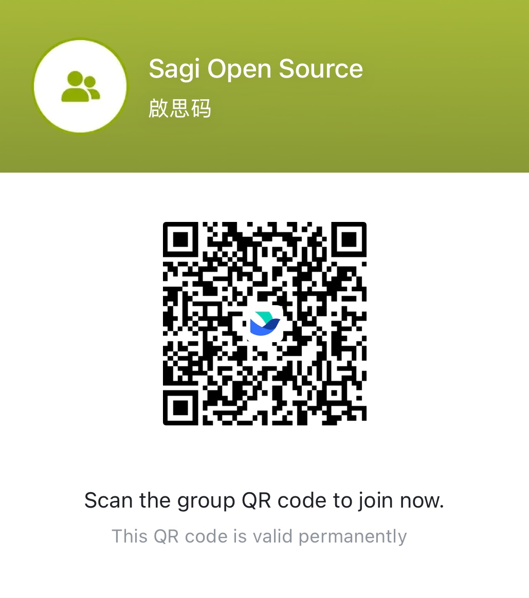

<p align="center">
  
</p>

<div align="center">

[](https://opensource.org/licenses/Apache-2.0)

</div>

## 🎯 About

Sagi is a production-ready, open-source LLM agent framework that combines advanced technologies to create powerful AI agents. It features:

- 🧠 Deep-research workflow architecture, more details refers to the [doc](src/Sagi/workflows/planning.md)
- 🛠️ MCP (Model Context Protocol) integration, the guide of the usage of MCP refers to the [doc](src/Sagi/mcp_server/README.md)
- 📊 GraphRAG-powered retrieval system, HiRAG mcp server refers to the [repo](https://github.com/Dormiveglia-elf/hirag_mcp.git)

## 📰 News

- [2025/04] 🔥 Sagi is publicly released!

## 🔜 Coming Soon
- Interactive Web UI
- Advanced file chunking & indexing supports
- Improved documentation with more demos
- Chat history & workflow state management

## 🚀 Quick Start

### Prerequisites

1. **System Requirements**
   - Docker and Docker Compose ([Installation Guide](dev/prerequesits.md))

2. **Clone the Repository**
   ```bash
   git clone https://github.com/Kasma-Inc/Sagi.git
   cd Sagi
   git submodule update --init --recursive  # Download MCP servers and Markify(MinerU)
   ```

3. **Environment Setup**
   ```bash
   cp .env.example .env
   ```
   Configure the following in your `.env` file:
   - `OPENAI_API_KEY` - Your OpenAI API key
   - `BRAVE_API_KEY` - Your [Brave Search API key](https://github.com/modelcontextprotocol/servers/tree/main/src/brave-search#getting-an-api-key)
   - `OPENAI_BASE_URL` - (Optional) Custom endpoint URL

### Installation & Running

1. **Build the Docker Container**
   ```bash
   chmod +x dev/setup.sh
   ./dev/setup.sh
   ```

2. **Access the Container** (Choose one method)
   - **Option A:** Use [VSCode Remote Container](https://marketplace.visualstudio.com/items?itemName=ms-vscode-remote.remote-containers) (Recommended). You can run `bash dev/install_vscode_extensions.sh` to install the basic plugins for the development.
   - **Option B:** Access via terminal:
     ```bash
     docker exec -it "$(whoami)_chatbot_python" /bin/bash
     ```

3. **Install Dependencies**
   - **Option A:** pip install
   ```bash
   pip install -e .
   ```
   - **Option B:** uv install
   ```bash
   uv venv
   source .venv/bin/activate
   uv pip install -e .
   ```

4. **Start CLI**
   ```bash
   python cli.py
   ```

## 🤝 Contributing

We welcome contributions! Please feel free to submit a pull request. We also welcome any questions via Github Issues or via the community group, please join us.

<div align="center" style="display: flex; gap: 20px;">
    
</div>

## 📄 License

This project is licensed under the Apache License 2.0 - see the [LICENSE](LICENSE) file for details.
