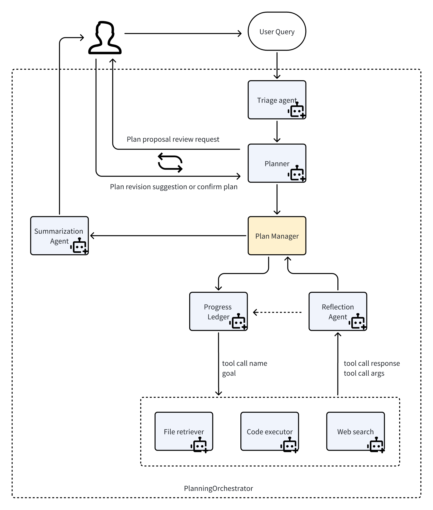

# Planning Workflow

The Planning Workflow is a sophisticated multi-agent system designed to support complex problem-solving through multi-step reasoning, reflection, and tool integration. This workflow enables agents to leverage various capabilities including file retrieval, web search, code execution, and more to accomplish tasks automatically.

## Architecture

The workflow architecture is illustrated in the diagram below:

The system orchestrates interactions between multiple specialized agents, each contributing unique capabilities to the problem-solving process. The workflow incorporates reflection mechanisms to evaluate progress and adjust plans dynamically.

## References

This implementation is built on several excellent projects:

- [AutoGen](https://github.com/microsoft/autogen/tree/main) 
- [Model Context Protocol (MCP)](https://github.com/modelcontextprotocol/servers) 
- [MagneticOne](https://microsoft.github.io/autogen/dev/user-guide/agentchat-user-guide/magentic-one.html)
- [Manus](https://manus.im/)